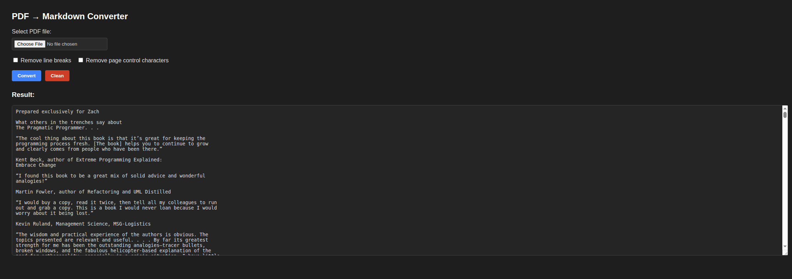

# 🦊 PDF → Markdown Converter

A simple yet powerful **web-based and API-accessible** PDF text converter built with **Python + Flask + pdfminer.six**.
Extract readable text from PDF files instantly — right from your browser or via an API request.

---

## ✨ Features

* 🖤 **Beautiful Dark UI** – Clean and modern interface.
* ⚙️ **PDF to Markdown/Text** – Extracts plain text from PDFs using `pdfminer.six`.
* 🧹 **Smart Cleanup Options**:

  * Remove line breaks (`\n`)
  * Remove page control characters (`\f`)
* 🧼 **One-click “Clean” button** to reset everything.
* 🔌 **API endpoint** for programmatic use — great for automation or integrations.

---

## 🖥️ Web Interface Preview

> 📸 *Add a screenshot here after running the app locally*
>
> Example:
>
> ```
> 
> ```

---

## 🚀 Getting Started

### 1️⃣ Install dependencies

```bash
pip install flask pdfminer.six
```

### 2️⃣ Run the server

```bash
python app.py
```

### 3️⃣ Open in your browser

Navigate to:
👉 **[http://localhost:5000](http://localhost:5000)**

Upload your PDF, toggle cleanup options, and enjoy instant results.

---

## 🔌 API Usage

The application exposes a lightweight API at:

```
POST /api/convert
```

### 📦 Request

**Content-Type:** `multipart/form-data`

| Field              | Type    | Description                                      |
| ------------------ | ------- | ------------------------------------------------ |
| `pdf_file`         | File    | PDF file to convert (required)                   |
| `remove_breaks`    | Boolean | Optional — remove line breaks (`\n`)             |
| `remove_page_ctrl` | Boolean | Optional — remove page control characters (`\f`) |

---

### 🧪 Example with `curl`

**Basic conversion**

```bash
curl -X POST -F "pdf_file=@sample.pdf" \
     http://localhost:5000/api/convert
```

**With cleanup options**

```bash
curl -X POST \
     -F "pdf_file=@sample.pdf" \
     -F "remove_breaks=true" \
     -F "remove_page_ctrl=true" \
     http://localhost:5000/api/convert
```

---

### 🧠 Example API Response

```
This is the extracted text content from your PDF file...
```

Plain text only — no HTML.

---

## 🧩 Tech Stack

* **Python 3.8+**
* **Flask** – lightweight web framework
* **pdfminer.six** – robust PDF text extraction library
* **HTML + CSS (Dark Mode)** – for a modern, clean interface

---

## 🛠️ Project Structure

```
.
├── app.py              # Main Flask app
├── README.md           # This file
└── requirements.txt    # (optional) Add dependencies here
```

Example `requirements.txt`:

```
flask
pdfminer.six
```

---

## 🧑‍💻 Development Notes

* Designed for simplicity — runs entirely offline.
* Can be deployed easily on any server (Heroku, Render, EC2, etc.).
* Extendable: add authentication, convert to DOCX, or export to Markdown with formatting.

---

## ⚖️ License

MIT License © 2025
Created by [Your Name or Company] 🦊

---

### ⭐ Found it useful?

Give the repo a star on GitHub — it helps others discover it!
